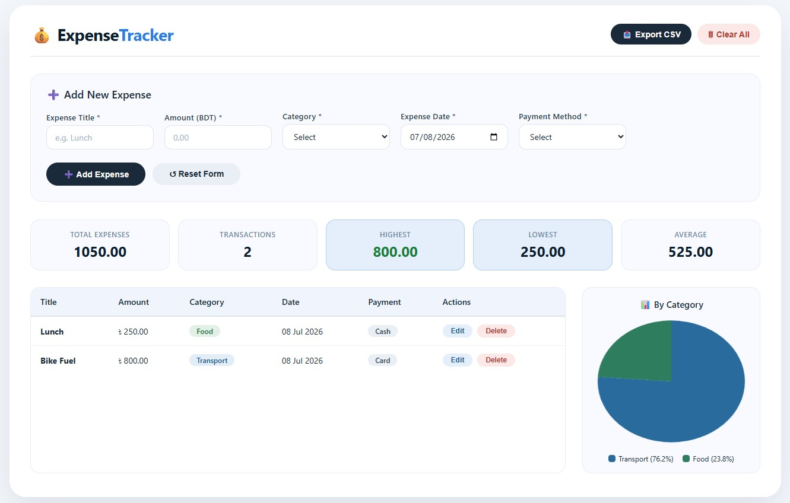

# 💰 Personal Expense Tracker (CRUD)

A simple and responsive **Personal Expense Tracker** built using **HTML, CSS, and JavaScript**. This application helps users manage their daily expenses with complete **CRUD (Create, Read, Update, Delete)** functionality.

---

## 📌 Features

### ✅ Create Expense
- Add a new expense.
- Input validation for all required fields.
- Amount must be greater than 0.

### 📋 Read Expenses
- Display all expenses in a responsive table.
- Shows:
  - Expense Title
  - Amount (BDT)
  - Category
  - Expense Date
  - Payment Method
  - Action Buttons

### ✏️ Update Expense
- Edit an existing expense.
- Form is automatically populated with selected expense details.
- Save updated information.

### 🗑️ Delete Expense
- Delete an expense with confirmation.
- Table updates instantly.

---

## 📊 Summary Dashboard

The application automatically calculates:

- Total Expenses
- Total Number of Transactions
- Highest Expense
- Lowest Expense
- Average Expense

---

## ✅ Form Validation

The following validations are implemented:

- All fields are required.
- Amount must be a positive number.
- Invalid data cannot be submitted.

---

## ⭐ Bonus Features

- Local Storage support (Data remains after page refresh)
- Export expenses as CSV
- Expense Pie Chart by Category
- Clear All Expenses button

---

## 🛠️ Technologies Used

- HTML5
- CSS3
- JavaScript (ES6)
- Local Storage API
- Chart.js (for Pie Chart)

---

## 📂 Folder Structure

```
expense-tracker/
│── index.html
│── style.css
│── script.js
│── README.md
```

---

## 🚀 How to Run

1. Download or clone the repository.

```
git clone https://github.com/yeaminhossainfuhad-cloud/Personal_Expense_Tracker_CRUD.git
```

2. Open the project folder.

3. Double-click **index.html**

or

Open **index.html** using any modern web browser.

No installation or server setup is required.

---

## 📸 Application Features

- Responsive Design
- Clean User Interface
- Real-time Summary Calculation
- CRUD Operations
- Local Storage Support
- CSV Export
- Expense Analytics



---

## 📖 Expense Categories

- Food
- Transport
- Shopping
- Bills
- Entertainment
- Others

---

## 💳 Payment Methods

- Cash
- bKash
- Nagad
- Card

---

## 🎯 Learning Objectives

This project demonstrates:

- DOM Manipulation
- Event Handling
- Form Validation
- JavaScript Arrays & Objects
- CRUD Operations
- Local Storage
- Dynamic Table Rendering
- Data Calculation
- File Export (CSV)
- Chart Integration

---

## 👨‍💻 Author

**Yeamin Hossain Fuhad**

- Diploma in Engineering (Computer Science & Technology)
- B.Sc. in Computer Science & Engineering
- IT Support Engineer
- Aspiring Software Quality Assurance (SQA) Engineer

---

## 📄 License

This project is developed for educational purposes.

Feel free to use, modify, and improve it for learning.

---

## ⭐ Project Status

✅ Completed

```
Personal Expense Tracker using HTML, CSS, and JavaScript with full CRUD functionality.
```
